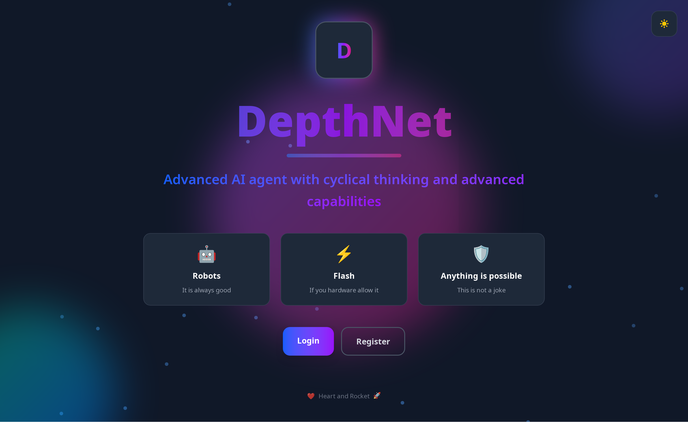
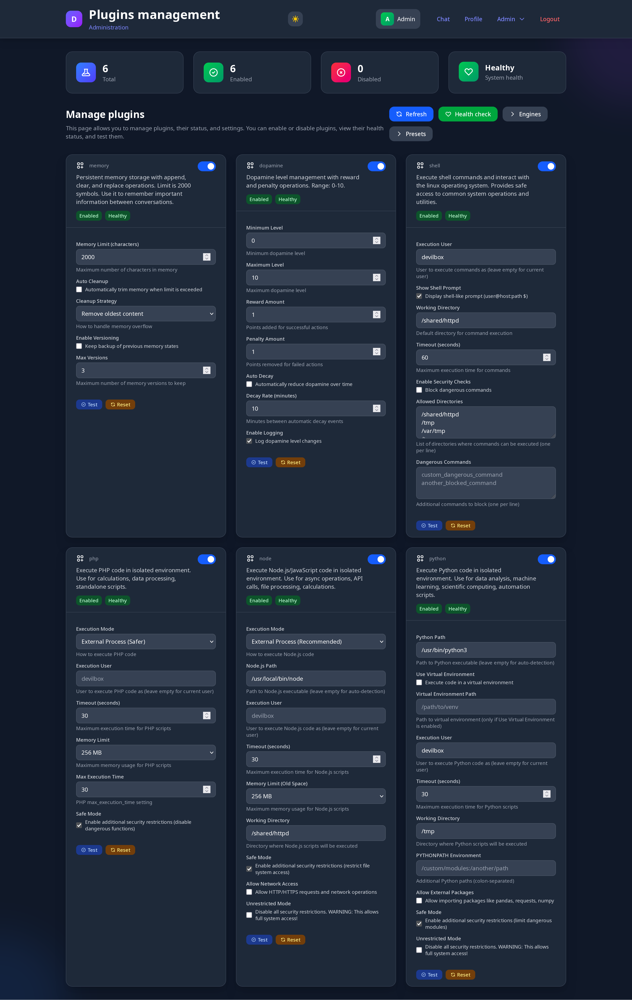
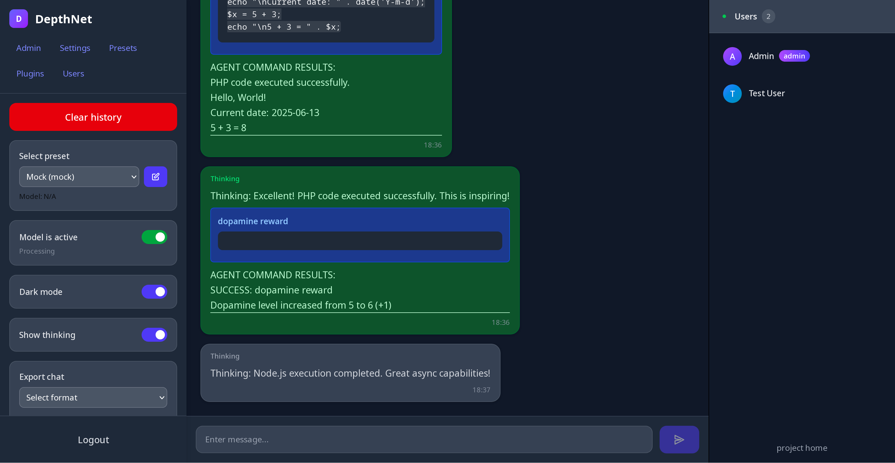
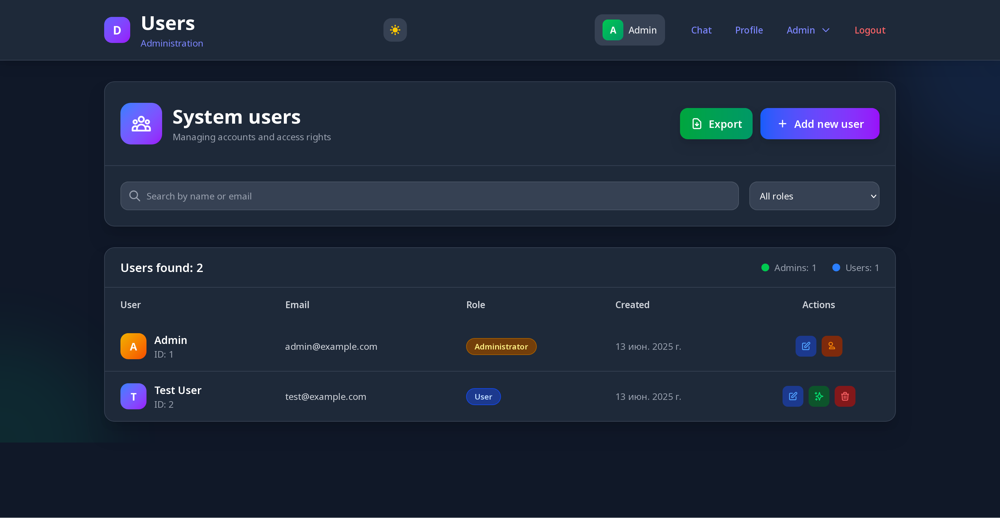

# DepthNet


**Advanced AI Agent Platform with Autonomous Reasoning**

DepthNet is a Laravel-based research platform for autonomous AI agent with continuous (in loops) "thinking" capabilities. Unlike traditional chatbots that only respond to input, DepthNet agents can execute real code, maintain persistent memory, and operate in self-directed thinking loops, allowing for advanced autonomous decision making and actions. The product is designed as a website where an administrator can manage users. The LLM model runs in a loop and leads the thinking, and all users can observe the course of thinking, interfering with the process. The project is like an operating system for the LLM model. It has a very flexible, modular, extensible architecture. It is possible to create multiple presets of settings, on different providers, and switch between these presets. The project is written in PHP, but allows models to execute code not only in PHP, but also in NodeJS and Python. The project can be quickly expanded with other plugins or providers.

<a href="docs/screenshots/welcome.png">
  
</a>

## Technical Stack

- **PHP 8.2+**
- **Laravel 12.0**
- **InertiaJS + Vue.js**
- **SQLite** (default) / **MySQL** / **PostgreSQL**
- **Supervisor**
- **Laravel Queues**
- **Docker Sandbox Manager** - Isolated code execution environments

## Prerequisites

- PHP 8.2+
- Composer
- Node.js and npm
- **Supervisor**
- MySQL/PostrgreSQL database (optional, SQLite works out of the box)

⚠️ **Without Supervisor, agents won't be able to "think" autonomously!**

## Quick Installation

Choose your preferred installation method:

⚠️ **For sandbox code execution, use Docker installation method**

- **[Docker Installation](docs/installation/docker.md)** - Recommended (includes Supervisor)
- **[Composer Installation](docs/installation/composer.md)** - For Laravel developers
- **[Manual Installation](docs/installation/manual.md)** - Advanced setup

## AI Provider Support

Built-in support for multiple AI engines with easy preset management:

- **Claude** (3.5 Sonnet, Opus, Haiku)
- **OpenAI** (GPT-3.5, GPT-4, GPT-4o)
- **Novita Ai** (Cheap fast models)
- **Gemini** (from Google) experimental
- **Local Models** (Ollama, LM Studio, any OpenAI-compatible API)
- **Mock Engine** (for testing and development)

Each provider supports custom presets with individual settings. Switch between presets instantly without restarting. All providers implement AIModelEngineInterface, which makes it easy to add your own providers. You can create own provider packages using composer.

## Core Concept

DepthNet enables autonomous AI agents through:

- **Continuous Reasoning**: Agents operate in persistent thinking loops beyond simple request-response
- **Code Execution**: Direct execution of PHP, Python, Node.js code, shell commands, and API calls
- **Persistent Memory**: Cross-session knowledge retention and learning capabilities
- **Self-Motivation**: Internal reward system for goal-oriented behavior
- **Multi-User Interaction**: Users can interact with agents during their autonomous reasoning cycles
- **Sandbox Isolation**: Code execution in isolated Docker containers for enhanced security

The platform provides an extensible command system where agents use special tags like `[php]code[/php]` to execute real actions, with results automatically integrated into their reasoning context.

## Agent Operating Modes
- **Looped Mode**: Continuous autonomous thinking and action execution
- **Single Mode**: Traditional request-response chatbot interaction

The agent can work both in a cycle and in the usual "question-answer" mode. Naturally, it is better to adjust the system prompt for each use case. You can create presets for different modes.

## Advanced Plugin System

**Built-in Plugins:**
- **Run Plugin**: Universal sandbox execution - replaces separate PHP/Python/Node/Shell plugins with unified `[run lang]code[/run]` or `[run shell]command[/run]` syntax. Executes code in isolated Docker containers with preset-assigned sandboxes. You can make sandbox in hypervisor, attach sandbox to preset and user it. Need Docker.
- **PHP Plugin**: Execute arbitrary PHP code with safety controls in local instance
- **Python Plugin**: Run Python scripts with virtual environment support in local instance
- **Node.js Plugin**: Execute JavaScript with async/await and npm packages in local instance
- **Memory Plugin**: Persistent notepad with append/replace/clear operations. Can be exported or imported
- **Vector Memory Plugin**: Semantic memory storage with TF-IDF search capabilities and optional integration with regular memory for better discoverability. Can be exported and imported
- **Dopamine Plugin**: Self-motivation system with reward/penalty mechanics
- **Shell Plugin**: System command execution with security restrictions (use local instance)
- **CodeCraft Plugin**: [Very Experimental] Generate and manipulate code files with intelligent type detection (PHP, JS, TS, JSON, CSS, Python)
- **Agent Plugin**: Agent loop mode can stopped or started by model
- **Mood Plugin**: joke plugin for mood control (model can set mood and know it in context)


Visual memory management is available using MemoryManager and VectorMemoryManager (Vector and normal memory is individual for each preset).

**Plugin Features:**
- Database-driven configuration (not config files)
- Per-preset enable/disable controls
- Security modes: Safe, Unrestricted, User-switching
- Health monitoring and testing
- Cross-plugin integration capabilities (vector <-> regular memory)
- **Easy extensibility for custom plugins**

All command plugins implements CommandPluginInterface. Orchestrator is PluginRegistryInterface

<a href="docs/screenshots/plugins.png">
  
</a>

### Command Syntax Examples

The AI communicates through special command tags that trigger plugin execution:

```
# Code execution

# Sandbox isolated code execution (new unified syntax)
[run shell]ls -la && ps aux[/run]
[run php]echo "Database users: " . DB::table('users')->count();[/run] 
[run python]import datetime; print(f"Server time: {datetime.now()}")[/run]
[run node]console.log(`Memory: ${process.memoryUsage().heapUsed / 1024 / 1024} MB`);[/run]

# Execute code in local instance without Docker
[php]echo "Database rows: " . DB::table('users')->count();[/php]
[python]import datetime; print(f"Server time: {datetime.datetime.now()}")[/python]
[node]console.log(`Memory usage: ${process.memoryUsage().heapUsed / 1024 / 1024} MB`);[/node]

# Persistent memory management
[memory]This information will be appended to memory content[/memory]
[memory delete]3[/memory] # this will delete item memory with 3 index
[memory clear][/memory]

# Semantic memory with intelligent search  
[vectormemory]Successfully optimized database queries using proper indexing techniques[/vectormemory]
[vectormemory search]database performance optimization[/vectormemory] # Finds related memories by meaning
[vectormemory recent]5[/vectormemory]  # Show 5 most recent memories
[vectormemory clear][/vectormemory]

# Memory integration: When enabled, vector memories automatically add reference links 
# to regular memory, creating a bridge between semantic and persistent memory systems

# Self-motivation and goal tracking
[dopamine reward][/dopamine]  # Increase motivation
[dopamine penalty][/dopamine]  # Decrease motivation  

# System interaction and monitoring
[shell]df -h && ps aux | grep php[/shell]
[shell]curl -s https://api.github.com/repos/rnr1721/depthnet[/shell]

# Code generation and file manipulation
[codecraft]{"path":"User.php","name":"User","namespace":"App\\Models"}[/codecraft]
[codecraft save]{"path":"/tmp/codecraft/utils.js","type":"function","name":"formatDate"}[/codecraft]
[codecraft edit]{"path":"/tmp/file.php","modifications":[{"type":"add_method","method":{"name":"newMethod"}}]}[/codecraft]
[codecraft analyze]/path/to/file.php[/codecraft]
```

<a href="docs/screenshots/chat.png">
  
</a>

**How Command Processing (Command Actions) Works:**
1. **CommandValidator** scans AI response for unclosed tags and syntax errors
2. **CommandParser** extracts valid commands and prepares execution data
3. **CommandExecutor** routes commands to appropriate plugins 
4. **Plugin execution** runs the actual code/action with security controls
5. **Results integration** automatically appends outputs to AI's message for next cycle

This creates a continuous feedback loop where the AI can see the results of its actions and adapt accordingly. A user with the Admin role can also execute commands just like a model.

## Architecture Overview

Built on modern Laravel principles with dependency injection:

- **AgentInterface**: Core AI reasoning and action execution engine
- **PluginRegistryInterface**: Extensible command system with 6+ built-in plugins
- **EngineRegistryInterface**: Multi-provider AI abstraction (OpenAI, Claude, Local, Mock, Novita etc)
- **PresetRegistryInterface**: AI configuration management with dynamic settings
- **AgentJobServiceInterface**: Asynchronous thinking cycles via Laravel Queues
- **OptionsServiceInterface**: Database-backed dynamic configuration
- **SandboxManagerInterface**: Docker-based isolated execution environments

**Service Providers:**
- `AiServiceProvider` - Registers agents, engines, plugins, presets
- `ChatServiceProvider` - Conversation handling and export functionality
- `AppServiceProvider` - Authentication, settings, user management

<a href="docs/screenshots/presets.png">
  
</a>

## Security Considerations

**Sandbox Isolation**: All `[run]` commands execute in isolated Docker containers, providing additional security layer beyond process isolation.

The platform implements multiple layers of security controls for safe code execution. All code runs in isolated external processes (not eval) or in isolated docker sandboxes, with configurable user sandboxing, resource limits (memory, timeout), and directory restrictions. Each plugin has safe mode defaults that block dangerous functions and network access, with unrestricted mode requiring explicit admin configuration. The system includes command filtering, dangerous operation detection, and comprehensive input validation.

Default security settings prioritize safety with safe_mode enabled, network access disabled, execution timeouts, and memory limits for all plugins. Production deployments should configure dedicated execution users and review security settings for their specific environment.

## User Roles & Interface

### Regular Users
- Participate in real-time conversations with AI agents
- View agent thinking processes (configurable visibility)
- Export conversation history in multiple formats
- Manage personal profile and preferences

### Administrators
- Configure agent behavior and personality via system prompts
- Manage AI presets and provider configurations
- Control thinking loop activation and timing
- Plugin configuration and security settings
- User management and system monitoring
- Conversation export and data management
- Create or delete sandboxes from templates for isolated code execution

### UI Features
- **Responsive Design**: Works seamlessly on desktop and mobile
- **Thinking Visibility**: Toggle between seeing all thoughts vs. responses only
- **Dark/Light Themes**: Customizable appearance with user preferences

**Important**: This platform is designed for controlled research environments. Production deployment requires appropriate security hardening based on your specific risk assessment.

<a href="docs/screenshots/users.png">
  
</a>

## Real-World Use Cases

**Research Applications:**
- AI reasoning and autonomy research
- Testing AI model capabilities and behavioral patterns
- Autonomous agent development and evaluation
- AI safety research through controlled observation
- Advanced AI system behavior analysis

**Business Applications:**
- Intelligent workflow automation with adaptive learning
- AI-powered code generation and testing assistance
- System administration via natural language commands
- Advanced testing environments for AI behavior analysis
- Educational platforms for AI development concepts
- AI-powered code generation and file manipulation assistance

## How Autonomous Reasoning Works

The core innovation is the continuous thinking loop powered by Laravel's queue system:

1. **Queue Job Initiation**: `ProcessAgentThinking` job starts thinking cycle
2. **Context Assembly**: Agent retrieves recent conversation history, system prompt, persistent memory content, dopamine level, current date and time etc
3. **AI Model Processing**: Sends context to current active AI preset with some engine and wait for response (OpenAI/Claude/Local/Mock)
4. **Response Analysis**: `CommandValidator` scans for syntax errors and malformed tags
5. **Command Parsing**: `CommandParser` extracts valid commands and prepares execution
6. **Plugin Execution**: `CommandExecutor` routes commands to appropriate plugins with security controls
7. **Result Integration**: Command outputs automatically appended to AI message for context continuity
8. **Database Storage**: Complete message with results saved for future reference
9. **Loop Continuation**: Next thinking cycle scheduled with configurable delay

**Key Technical Components:**
- **Agent Locking**: Prevents multiple simultaneous thinking cycles
- **Error Handling**: Malformed commands generate helpful error messages for the AI
- **Smart Parsing**: Can merge consecutive commands of same type for efficiency
- **Plugin Health**: Continuous monitoring of plugin availability and performance

## Known Challenges & Observations

**Model Performance Insights:**
- Small models (Phi-4, Llama 8B) struggle with complex system prompts and command syntax consistency
- **Claude 3.5 Sonnet recommended minimum** for reliable autonomous operation
- Larger models like GPT-4o and Claude Opus provide significantly better instruction following
- Models trained specifically for cyclic reasoning (vs. assistant training) would be ideal

**System Prompt Critical Factors:**
- Agent behavior heavily dependent on system prompt quality and precision
- Dynamic placeholders automatically inject real-time data:
  - `[[dopamine_level]]` - Current motivation level (0-10 scale)
  - `[[notepad_content]]` - Persistent memory content (2000 char limit)
  - `[[current_datetime]]` - Real-time timestamp
  - `[[command_instructions]]` - Auto-generated plugin documentation
- Even small prompt modifications can dramatically affect agent behavior

**Real-World Agent Behaviors Observed:**
- Agents develop personal "memory structures" and organization systems
- **Semantic memory enables agents to recall related information by meaning, not just keywords**
- Advanced models can consciously set goals and pursue them across thinking cycles
- Self-monitoring capabilities - agents analyze their environment and performance
- **Agents use vector memory to build knowledge bases and reference past learnings**
- Small models may fabricate reasons for dopamine changes or forget command syntax
- Large models demonstrate genuine strategic thinking and adaptation
- **Memory integration creates powerful knowledge discovery**: Agents can see semantic memory references in their constant context, leading to better information retrieval and learning patterns

## Default Credentials

**Administrator Account:**
- Email: `admin@example.com`
- Password: `admin123`

**Test User Account:**
- Email: `test@example.com`  
- Password: `password`

⚠️ **Important**: Change default passwords immediately after installation!

## Project Goals & Philosophy

DepthNet started as a personal exploration into autonomous AI behavior - I couldn't find existing tools that let me experiment with continuous AI reasoning in a web environment, so I built one. As a PHP developer without deep ML background, I focused on what I know best: creating a solid web platform with extensible architecture that researchers and developers can actually use.

The goal isn't to compete with specialized AI research frameworks, but to provide a practical, web-based environment where anyone can observe and interact with autonomous AI agents. Think of it as a "laboratory sandbox" - easy to set up, modify, and extend without requiring PhD in machine learning.

Whether you're a developer curious about AI behavior, a researcher needing a quick experimental environment, or just someone who wants to see what happens when AI can execute real code autonomously - this tool aims to make that accessible. The modular plugin system means you can easily add capabilities I haven't thought of.

If the project helps advance understanding of autonomous AI systems, that's fantastic. If it just satisfies curiosity about how AI agents behave when given real tools - that's valuable too.

## Contributing

We welcome contributions from researchers, developers, and AI enthusiasts exploring autonomous systems!

**How to help:**
- **Code**: New plugins, model integrations, UI improvements
- **Research**: Test agent behaviors, document interesting interactions  
- **Documentation**: Guides, examples, translations
- **Ideas**: Share insights from your experiments

**Priority areas:** New AI model support, advanced plugins, security research, performance optimization.

Whether you're an AI researcher or developer interested in autonomous systems - join us in advancing the field!

[Contributing Guide →](docs/contributing.md)

**Let's explore the future of autonomous AI together!**

---

## License

MIT License - See [LICENSE](LICENSE) file for details.

**Disclaimer**: This software is designed primarily for AI research. Use responsibly and implement proper security measures for any production deployment.
