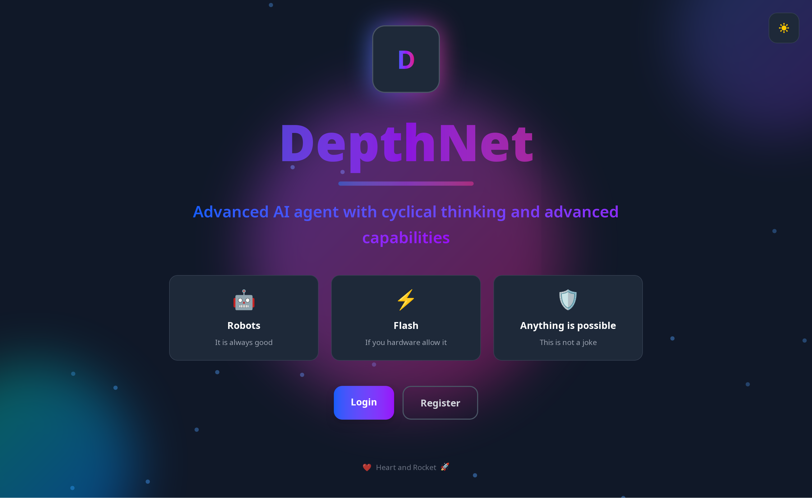
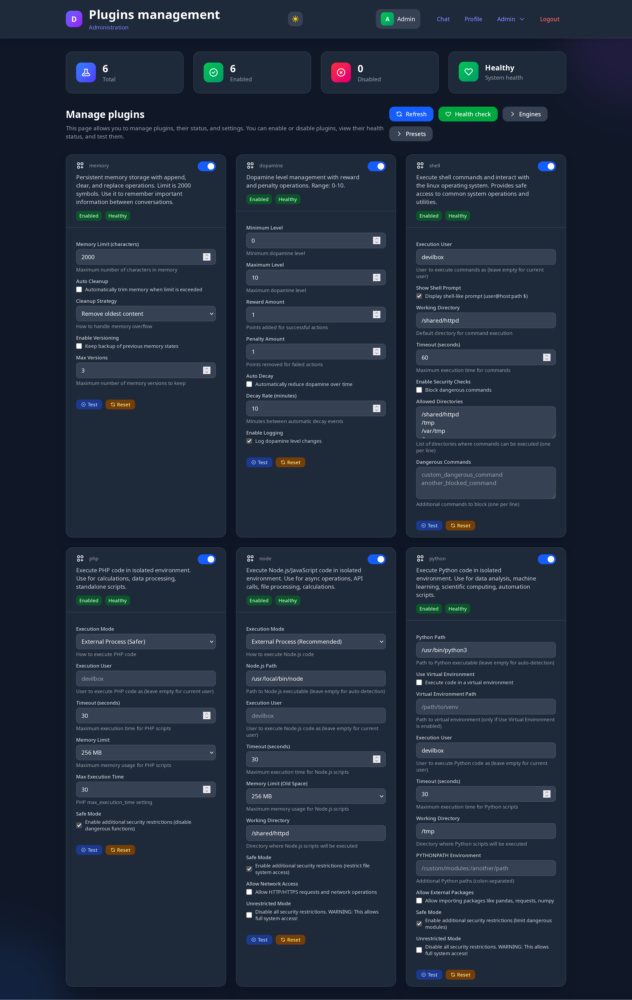
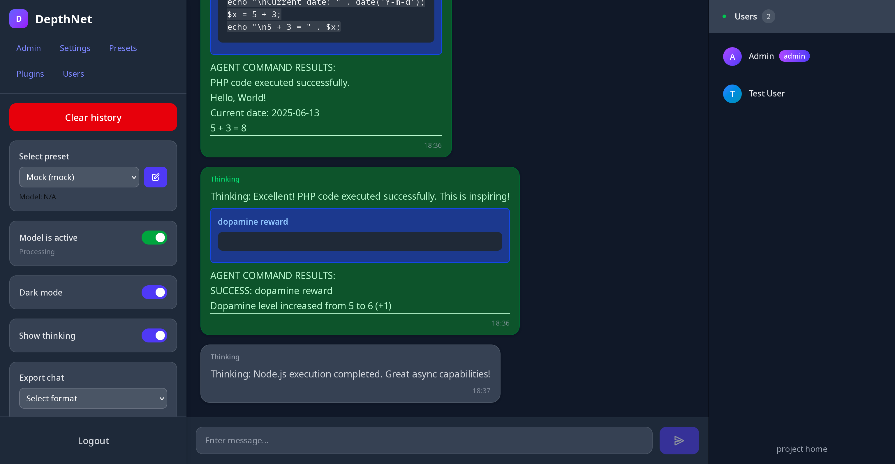
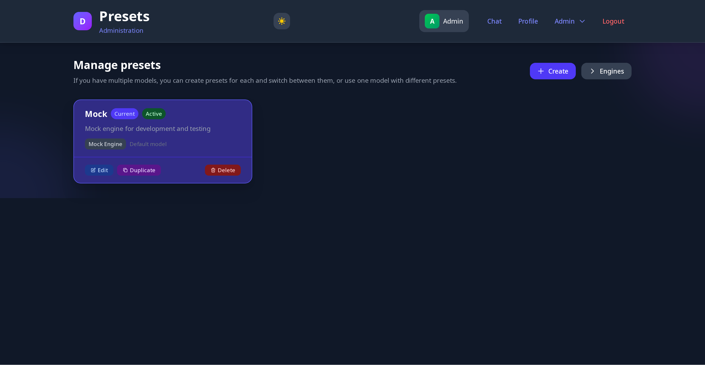
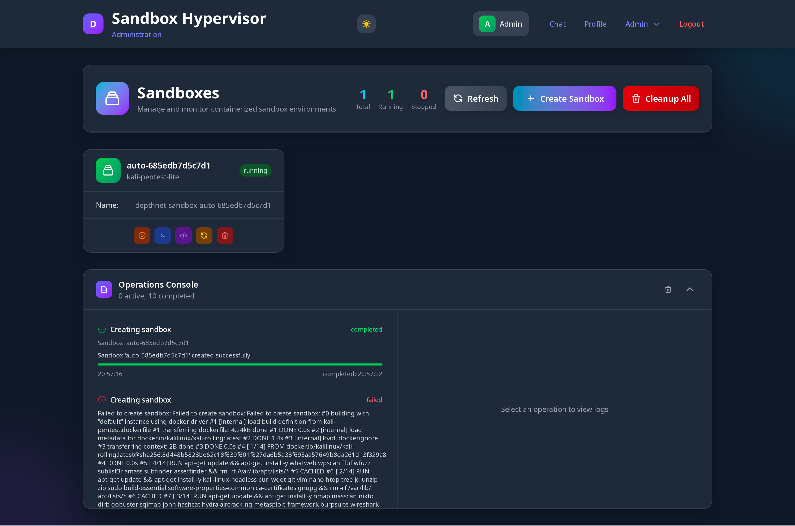
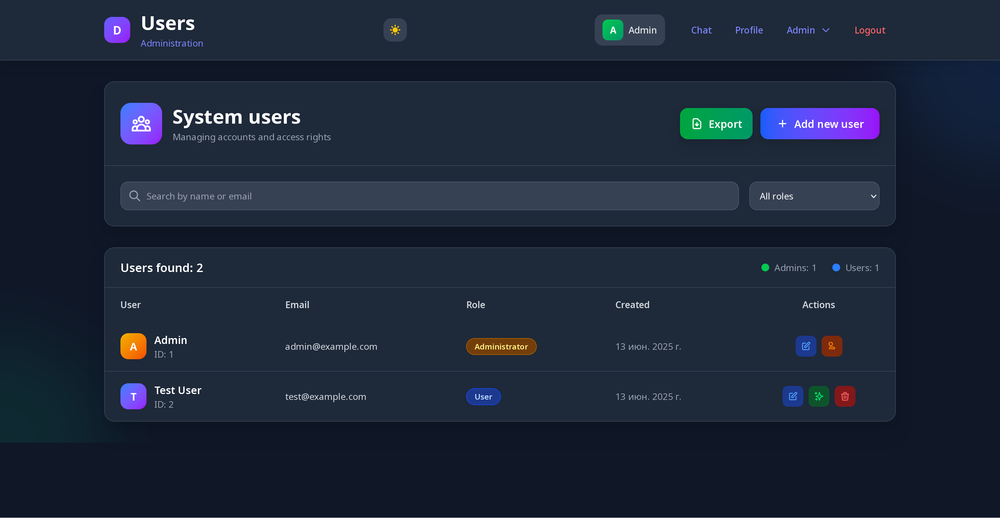

# DepthNet


**Autonomous AI Agent Platform with Orchestrated Workflows** | v0.9.7

DepthNet is a Laravel-based operating system for autonomous AI agents. It provides a modular, extensible runtime where LLM models don't just respond to prompts — they think continuously in self-directed loops, execute real code, and maintain persistent and semantic memory — including dense embedding vectors with graph-based associative retrieval across both episodic journal and semantic memory stores.

The platform supports two complementary operating paradigms:

- **Free-form mode** — presets with continuous thinking loops, handoff-based delegation, inner voice, and the full plugin ecosystem. Designed for autonomous, open-ended agents that develop their own reasoning patterns over time.
- **Orchestrated mode** — structured agents composed of a planner preset and typed roles (executor, critic, validator, etc.), coordinated by a deterministic orchestrator with task lifecycle management. Designed for reliable, observable multi-step workflows.

Both modes share the same provider abstraction, plugin system, memory infrastructure, and web interface — you choose the paradigm per use case, or combine both in the same installation.


<a href="docs/screenshots/welcome.png">
  
</a>

## Technical Stack

- **PHP 8.2+**
- **Laravel 12.0**
- **InertiaJS + Vue.js**
- **SQLite** (default) / **MySQL** / **PostgreSQL**
- **Supervisor**
- **Laravel Queues**
- **Docker Sandbox Manager** - Isolated code execution environments

## Prerequisites

- PHP 8.2+
- Composer
- Node.js and npm
- **Supervisor**
- MySQL/PostgreSQL database (optional, SQLite works out of the box)

⚠️ **Without Supervisor, agents won't be able to "think" autonomously!**

## Quick Installation

Choose your preferred installation method:

⚠️ **For sandbox code execution, use Docker installation method**

- **[Document Manager](docs/plugins/documents.md)** — file storage and semantic search for agents

- **[Code Plugin](docs/plugins/code.md)** — sandbox filesystem navigation and editing

- **[Docker Installation](docs/installation/docker.md)** - Recommended (includes Supervisor)
- **[Composer Installation](docs/installation/composer.md)** - For Laravel developers
- **[Manual Installation](docs/installation/manual.md)** - Advanced setup

- **[Text-to-Speech and voice input](docs/ui/text-to-speech.md)** - Browser setup for voice input and text-to-speech
- **[Rhasspy](docs/integrations/README-RHASSPY.md)** - Rhasspy integration

- **[Reverse proxy](docs/installation/reverse-proxy.md)** - instruction for production environments

- **[How agents work](docs/agent-concepts.md)** - Core concepts: presets, thinking cycles, placeholders, plugins, memory, RAG, inner voice, multi-agent workflows

## AI Provider Support

Built-in support for multiple AI engines with easy preset management:

- **Claude** (3.5 Sonnet, Opus, Haiku)
- **DeepSeek** (v3.2+, v4 coming soon)
- **OpenAI** (GPT-3.5, GPT-4, GPT-4o)
- **Novita Ai** (Cheap fast models)
- **Fireworks** (Fast inference provider)
- **Gemini** (from Google) experimental
- **Local Models** (Ollama, LM Studio, any OpenAI-compatible API)
- **Mock Engine** (for testing and development)

Each provider supports custom presets with individual settings. Each preset has an independent cycle, switching in the UI does not affect the execution. All providers implement AIModelEngineInterface, which makes it easy to add your own providers. You can create own provider packages using composer.

## Core Concept

DepthNet enables autonomous AI agents through:

- **Continuous Reasoning**: Agents operate in persistent thinking loops beyond simple request-response
- **Code Execution**: Direct execution of PHP, Python, Node.js code, shell commands, and API calls
- **Persistent Memory**: Cross-session knowledge retention and learning capabilities
- **Vector Memory with Associative Mode**: Two retrieval modes — standard (finds relevant memories) and associative (finds the most relevant memory, then expands to related ones for deeper context). Service Capabilities: Modular provider system for embedding, image, audio and other AI services. Each preset can have its own configured provider. GUI-driven configuration with per-driver config fields — no code changes needed to add new providers.
- **RAG (Retrieval-Augmented Generation)**: Multi-config RAG pipeline — attach one or more RAG presets to any agent, each with its own sources, retrieval mode, and limits. Results are deduplicated across configs and merged into a single `[[rag_context]]` block. Sources per config: vector memory (flat or associative), journal, skills, persons. The first (primary) config supports agent-queued queries via the RAG Query plugin; secondary configs always use model-formulated queries. Configs are ordered via drag-and-drop in the UI. [→](docs/memory/RAG.md)
- **MCP Integration**: Connect external Model Context Protocol servers per-preset, giving agents access to GitHub, databases, APIs and any other MCP-compatible service
- **Multi-Source Input (Pool Mode)**: Two input modes — `single` (classic user message) and `pool` (aggregates messages from multiple sources into a JSON payload, cleared on send). In loop mode, user and other source messages accumulate in the pool and are sent together on the next cycle
- **Inner Voice**: Multi-voice pipeline — attach one or more voice presets to any agent, each running independently and contributing a labeled block to [[inner_voice]]. Works in both single and loop modes. A separate cycle prompt preset can be configured for loop mode as an anti-loop mechanism — its output goes into the input pool rather than the system prompt.[→](docs/memory/inner-voice.md)
- **Self-Motivation**: Internal reward system for goal-oriented behavior
- **Multi-User Interaction**: Users can interact with agents during their autonomous reasoning cycles
- **Sandbox Isolation**: Code execution in isolated Docker containers for enhanced security
- **Agent Handoff**: Seamless delegation between specialized AI presets within single workflows
- **Known Sources**: Named data sources (sensors, projections, signals) defined per-preset. Their values are excluded from the regular input pool JSON and instead injected into the system prompt via `[[known_sources]]`, allowing the agent to treat sensor data as part of its own context rather than incoming messages
- **Pre-Run Commands**: Automatic command execution before each thinking cycle via CommandPreRunner. Results available in the system prompt via `[[pre_command_results]]` — useful for gathering fresh data before each cycle without explicit agent action
- **Document Manager**: File storage layer for agents — upload PDFs, spreadsheets, code and text files, chunk and index them for semantic search. Files live in Laravel storage (read-only reference) or directly in the sandbox (full agent access). Integrates with the RAG pipeline as a source (files in RAG config sources). Agents can search, inspect and delete files via the documents plugin. [→](docs/plugins/documents.md)
- **Code Plugin**: Structured filesystem access for agents working on software projects in their sandbox. Navigate directory trees, read files with precise line control (lines:N-M or around:functionName), search by text, and apply targeted edits via key-value replace or unified diff patch — without rewriting entire files. [→](docs/plugins/code.md)
- **Auto-Handoff Chains**: Presets can be configured with `preset_code_next` to automatically hand off to the next preset after every response, enabling pipeline workflows without prompt engineering
- **Multi-Agent Parallel Execution**: Multiple presets can be run in a loop simultaneously, independently of each other
- **Orchestrated Agent Workflows**: Structured agents with a planner preset and named roles (executor, critic, validator). A deterministic orchestrator manages task lifecycle — pending → in_progress → validating → done — without relying on prompt engineering for routing. Optional per-role validators retry or escalate tasks automatically. See [Orchestrated Mode](#orchestrated-agent-mode) below.
- **Native Tool Calls**: Presets can operate in `tool_calls` mode where plugin schemas are sent to the provider API and the model invokes plugins through the provider's native mechanism instead of tag syntax. Supports all major providers. See [Command Execution Modes](#command-execution-modes) below.

The platform provides an extensible command system where agents use special tags like `[php]code[/php]` to execute real actions, with results automatically integrated into their reasoning context.

## Agent Operating Modes
- **Looped Mode**: Continuous autonomous per-preset thinking and action execution
- **Single Mode**: Traditional request-response chatbot interaction

## Input Modes
- **Single**: Classic single-message input from the user
- **Pool**: Aggregates messages from multiple sources (user input, inner voice, external signals) into a JSON payload. The pool is cleared after each send. In loop mode, all sources accumulate between cycles

The agent can work both in a cycle and in the usual "question-answer" mode. Naturally, it is better to adjust the system prompt for each use case. You can create presets for different modes.

## Command Execution Modes

Each preset has an `agent_result_mode` setting that controls both how commands are executed and how results are stored:

- **`tool_calls`** (default) — Native provider tool-calling. Plugin schemas are sent to the provider API as a `tools` array; the model invokes plugins through the provider's structured mechanism instead of writing tag syntax. History is stored in the correct `assistant/tool` turn format required by provider APIs. Suitable for tool-oriented agents and production workflows. **For creative and imaginative agents, the tag mode might be suitable** — tag mode preserves the natural flow of thought within the model's output.

- **`internal`** — Results are pushed to CommandResultPool and injected into the next cycle's system prompt via `[[agent_command_results]]`. Recommended for autonomous agents — keeps results out of the conversation context where models can confuse them with their own previous output. The results may depend directly on the number of model parameters.

- **`separate`** — Response and command results are stored as separate messages. Results are visible in chat. Useful when you want the conversation history to clearly show what was executed.

  Supported providers for `tool_calls` mode: DeepSeek (V3.2+), Claude, OpenAI, Novita, Fireworks, Gemini (via OpenAI-compatible endpoint). For LocalModel — opt-in via `supports_tool_calls: true` in preset config, depends on the specific model and server.

## Advanced Plugin System

**Built-in Plugins:**

| Plugin | Description | Docs |
|---|---|---|
| **Sandbox** (`run`) | Execute PHP, Python, Node.js, and shell commands in isolated Docker containers. Requires a sandbox assigned to the preset. | [→](docs/plugins/sandbox.md) |
| **Terminal** (`terminal`) | Persistent interactive terminal (tmux) inside the sandbox. Working directory, running processes, and shell history survive between cycles. Supports special keys (`C-c`, `F10`, `Up`, etc.) for interactive programs. Monitor mode auto-injects screen via `[[terminal_screen]]`. | [→](docs/plugins/terminal.md) |
| **Shell** | Run shell commands directly on the host as the PHP process user. Use only for trusted operational tasks — prefer Sandbox for code execution. | [→](docs/plugins/shell.md) |
| **Memory** (`memory`) | Persistent flat notepad injected into every cycle via `[[notepad_content]]`. Best for identity anchors, rules, and always-visible facts. Supports export/import. | [→](docs/plugins/memory.md) |
| **Workspace** (`workspace`) | Persistent key-value scratchpad for structured working state — plans, drafts, intermediate results. Accessible via `[[workspace]]`. | [→](docs/plugins/workspace.md) |
| **Vector Memory** (`vectormemory`) | Semantic memory with TF-IDF and dense embedding search. Two retrieval modes: flat top-K and associative graph traversal. Supports defragmentation, export/import, and embedding backfill. | [→](docs/plugins/vector-memory.md) |
| **Document Manager** (`documents`) | File storage and semantic search for agents. Upload PDFs, spreadsheets, code and text — files are chunked and indexed automatically. Two storage modes: Laravel storage (read-only reference) or sandbox (full agent access). Integrates with RAG pipeline as a `files` source. | [→](docs/plugins/documents.md) |
| **Journal** (`journal`) | Episodic memory chronicle. Records typed, timestamped events (actions, decisions, errors, reflections) with semantic and date-filtered search. | [→](docs/plugins/journal.md) |
| **Skill** (`skill`) | Structured knowledge base of named skills with items. Semantically searchable via TF-IDF. Visible via `[[skills]]`. | [→](docs/plugins/skill.md) |
| **Person** (`person`) | Structured memory for people — facts, aliases, semantic search. Aliases stored as `Primary / Alias1 / Alias2`. Heart-aware via `[[persons_context]]`. | [→](docs/plugins/person.md) |
| **Goal** (`goal`) | Persistent goal tracker with progress history and statuses. Active goals always visible via `[[active_goals]]`. | [→](docs/plugins/goal.md) |
| **MCP** (`mcp`) | Connect any Model Context Protocol server per-preset. Supports Streamable HTTP (MCP spec 2025-03-26). Agent can optionally connect/disconnect servers autonomously. | [→](docs/plugins/mcp.md) |
| **Telegram** (`telegram`) | Full Telegram access via [tgcli](https://github.com/rnr1721/tgcli) — read/send messages, browse dialogs and channels, search. Real user account (MTProto), not Bot API. Per-preset session isolation. | [→](docs/plugins/telegram.md) |
| **Code** (`code`) | Structured sandbox filesystem access for software projects. Navigate directory trees, read files with line ranges or symbol context, search by text, apply targeted edits via key-value replace or unified diff patch. Requires sandbox. | [→](docs/plugins/code.md) |
| **Browser** (`browser`) | Persistent Playwright browser with session memory surviving across thinking cycles. Open pages, click, type, read structured snapshots. Requires `browser` Docker profile. | [→](docs/plugins/browser.md) |
| **Dopamine** (`dopamine`) | Self-motivation system. Agent rewards/penalises itself; level visible via `[[dopamine_level]]`. Optional auto-decay. | [→](docs/plugins/dopamine.md) |
| **Heart** (`heart`) | Attention and connection engine. Tracks named connections, emotional signals, dominant focus, and gravity. State visible via `[[heart_state]]`. Not an emotion simulator — a measurable attention system. | [→](docs/plugins/heart.md) |
| **Being** (`being`) | Self-authorship. Agent writes its own essence phrase, injected at the top of the next cycle via `[[being]]`. History via `[[being_history]]`. | [→](docs/plugins/being.md) |
| **Rhythm** (`rhythm`) | Temporal context snapshot: date/time, day/week/year progress, agent age, pause since last cycle, cycle count, weather, sunset/sunrise. Injected via `[[rhythm]]`. Open-Meteo, no API key needed. | [→](docs/plugins/rhythm.md) |
| **RAG Query** (`rag`) | Explicit RAG search control — agent queues specific queries for the next cycle. Applies only to the primary RAG config; secondary configs always use model-formulated queries. | [→](docs/plugins/rag.md) |
| **Agent** (`agent`) | Lifecycle control — pause/resume thinking cycles, check status, send visible messages to user (`speak`), hand off to another preset. | [→](docs/plugins/agent.md) |
| **Mode** (`mode`) | Switch the active system prompt mid-session. Agent can change its own reasoning style, personality, or focus by switching named prompt variants. | [→](docs/plugins/prompt.md) |
| **Mood** (`mood`) | Lightweight tone control — agent sets a named mood (`friendly`, `analytical`, `focused`, etc.) visible via `[[mood]]`. | [→](docs/plugins/mood.md) |
| **Agent Task** (`task`) | Task management for orchestrated workflows. Planner creates and assigns tasks to roles; roles complete or fail them; validators approve or reject. Orchestrator handles routing. Active tasks via `[[agent_tasks]]`. | [→](docs/plugins/task.md) |

Visual memory management is available using MemoryManager and VectorMemoryManager (Vector and normal memory is individual for each preset).

**Plugin Features:**
- Database-driven configuration (not config files)
- Per-preset enable/disable controls
- Security modes: Safe, Unrestricted, User-switching
- Health monitoring and testing
- Cross-plugin integration capabilities (vector <-> regular memory)
- **Easy extensibility for custom plugins**
- Each plugin implements `getToolSchema()` for precise tool description in `tool_calls` mode — or falls back to a default schema built from `getInstructions()` automatically

All command plugins implements CommandPluginInterface. Orchestrator is PluginRegistryInterface

<a href="docs/screenshots/plugins.png">
  
</a>

### Command Syntax Examples

The AI communicates through special command tags that trigger plugin execution. This is the default tag-based syntax used in `internal` and `separate` result modes. In `tool_calls` mode, the model invokes the same plugins natively through the provider API — no tag syntax needed.

```
# Code execution

# Sandbox isolated code execution (new unified syntax)
[run shell]ls -la && ps aux[/run]
[run php]echo "Database users: " . DB::table('users')->count();[/run] 
[run python]import datetime; print(f"Server time: {datetime.now()}")[/run]
[run node]console.log(`Memory: ${process.memoryUsage().heapUsed / 1024 / 1024} MB`);[/run]

# Agent workflow management
[agent handoff]analyst[/agent]  # Transfer control to another preset
[agent handoff]researcher:Find data about Tesla[/agent]  # Transfer with specific task
[agent pause][/agent]   # Pause autonomous thinking
[agent resume][/agent]  # Resume autonomous thinking
[agent status][/agent]  # Check current agent status

# Persistent memory management
[memory]This information will be appended to memory content[/memory]
[memory delete]3[/memory] # this will delete item memory with 3 index
[memory clear][/memory]

# Semantic memory with intelligent search  
[vectormemory]Successfully optimized database queries using proper indexing techniques[/vectormemory]
[vectormemory search]database performance optimization[/vectormemory] # Finds related memories by meaning
[vectormemory recent]5[/vectormemory]  # Show 5 most recent memories
[vectormemory clear][/vectormemory]

# Memory integration: When enabled, vector memories automatically add reference links 
# to regular memory, creating a bridge between semantic and persistent memory systems

# Self-motivation and goal tracking
[dopamine reward][/dopamine]  # Increase motivation
[dopamine penalty][/dopamine]  # Decrease motivation  

# System interaction and monitoring
[shell]df -h && ps aux | grep php[/shell]
[shell]curl -s https://api.github.com/repos/rnr1721/depthnet[/shell]

# MCP — external tool servers
[mcp github]search_repositories: {"query": "depthnet"}[/mcp]
[mcp github]get_file_contents: {"owner": "rnr1721", "repo": "depthnet", "path": "README.md"}[/mcp]
[mcp list][/mcp]                    # list connected servers and their tools
[mcp tools]github[/mcp]            # fetch tools from specific server

# Episodic journal
[journal]action | Refactored memory plugin[/journal]
[journal]decision | Chose approach A over B | Simpler implementation[/journal]
[journal]error | DB failed | Timeout after 30s | outcome:failure[/journal]
[journal recent]10[/journal]
[journal search]memory optimization[/journal]
[journal search]yesterday | errors[/journal]

# Self-authorship
[being]The will that chooses presence over habit[/being]
[being show][/being]
[being history][/being]

# Workspace scratchpad
[workspace set]current_plan: Optimize database queries[/workspace]
[workspace append]current_plan: Step 2 — add indexes[/workspace]
[workspace get]current_plan[/workspace]
[workspace list][/workspace]

# Heart — attention and connection tracking
[heart feel]Eugeny: curiosity[/heart]
[heart feel]DepthNet: love[/heart]
[heart connect]Eugeny: developer[/heart]
[heart state][/heart]
[heart focus][/heart]
[heart beat][/heart]

# Person memory with aliases and semantic search
[person]Женя | loves punk aesthetic and travel[/person]
[person recall]Женя[/person]          # recall by name or alias
[person recall]1[/person]             # recall by fact ID
[person find]James Kvakiani[/person]  # search across all aliases
[person search]developer Kharkiv[/person]  # semantic search over facts
[person alias add]1 | Жэка[/person]   # add alias to person (any fact ID)
[person alias remove]1 | Жэка[/person]
[person delete]42[/person]            # delete fact by ID
[person forget]Женя[/person]          # forget all facts about person
[person list][/person]

# Temporal context
[rhythm show][/rhythm]

# RAG query control
[rag query]Technical breakthroughs in AI self-regulation[/rag]
[rag show][/rag]
[rag clear][/rag]

# Browser — persistent Playwright browser with session memory
[browser open]https://example.com[/browser]
[browser search]best php frameworks 2026[/browser]
[browser snapshot][/browser]
[browser click]text=Submit[/browser]
[browser type]{"selector":"input[name=q]","text":"hello"}[/browser]
[browser press]Enter[/browser]
[browser scroll]500[/browser]
[browser back][/browser]
[browser close][/browser]

# Orchestrated task management (AgentTask Plugin)
# --- Planner preset ---
[task]Write a market summary | role: writer | Focus on Q1 2025 data[/task]
[task]Validate the report[/task]              # unassigned task
[task list][/task]                            # active tasks
[task list]all[/task]                         # all tasks including done/failed
[task show]42[/task]                          # task detail

# --- Role preset (executor) ---
[task done]42 | Summary written: ...[/task]   # mark completed with result
[task fail]42 | Data source unavailable[/task] # report failure

# --- Validator preset ---
[task approve]42 | Looks good, meets requirements[/task]
[task reject]42 | Missing Q1 breakdown, please revise[/task]

# Telegram — full MTProto access via user account
[telegram dialogs][/telegram]
[telegram dialogs]50 channels[/telegram]
[telegram read]@username 20[/telegram]
[telegram send]@username Hello![/telegram]
[telegram unread][/telegram]
[telegram search]@groupname keyword[/telegram]
[telegram info]@username[/telegram]
[telegram mark_read]@username[/telegram]
[telegram me][/telegram]

```

<a href="docs/screenshots/chat.png">
  
</a>

**How Command Processing Works:**

Two pipelines depending on the preset's `agent_result_mode`:

**Tag pipeline** (`internal` / `separate`):
1. **CommandValidator** scans AI response for unclosed tags and syntax errors
2. **CommandParser** extracts valid commands and prepares execution data
3. **CommandExecutor** routes commands to appropriate plugins
4. **Plugin execution** runs the actual code/action with security controls
5. **Results integration** automatically appends outputs to AI message for next cycle

**Tool calls pipeline** (`tool_calls`):
1. **ToolSchemaBuilder** assembles OpenAI-compatible tool schemas from enabled plugins
2. Schemas are sent to the provider API with each request
3. Model responds with structured `tool_calls` instead of tag syntax
4. **ToolCallParser** maps provider tool_calls to the same internal ParsedCommand format
5. **CommandExecutor** executes them identically — no changes at this layer
6. Results stored in `assistant/tool` turn format required by provider APIs

Both pipelines share the same CommandExecutor, plugin system, and inter-agent routing — only the parsing front-end differs.

A user with the Admin role can also execute commands just like a model.

## Browser Service

DepthNet includes an optional Playwright-based browser service that gives agents a persistent, stateful browser — sessions survive across thinking cycles, so an agent can open a page, reason about it, and return to it several cycles later without losing context.

The browser service runs as a separate Docker container and communicates with the Laravel app over HTTP. Each preset gets its own browser session identified by preset ID.

**Enabling the browser service:**

```bash
make browser-enable
make restart
```

**Disabling:**

```bash
make browser-disable
make restart
```

**What the agent sees** — instead of raw HTML, the browser returns a structured snapshot:

```
📄 Page Title
🔗 https://example.com

── Content ──
Main page text, cleaned of nav/footer/scripts...

── Inputs ──
  [search] q (Search...)  selector: input[name=q]

── Buttons ──
  [Submit]  selector: #submit-btn

── Links ──
  About  →  https://example.com/about
  Docs   →  https://example.com/docs
```

This gives the model enough to reason, navigate, and interact — without drowning in HTML noise.

## Architecture Overview

Built on modern Laravel principles with dependency injection:

- **AgentInterface**: Core AI reasoning and action execution engine
- **PluginRegistryInterface**: Extensible command system with 23 built-in plugins
- **EngineRegistryInterface**: Multi-provider AI abstraction (OpenAI, Claude, Local, Mock, Novita etc)
- **PresetRegistryInterface**: AI configuration management with dynamic settings
- **AgentJobServiceInterface**: Asynchronous thinking cycles via Laravel Queues
- **OptionsServiceInterface**: Database-backed dynamic configuration
- **SandboxManagerInterface**: Docker-based isolated execution environments
- **AgentMessageServiceInterface**: Asynchronous inter-agent message delivery with reply-to tracking
- **OrchestratorInterface**: Deterministic task dispatcher for orchestrated agent workflows
- **AgentTaskServiceInterface**: Task lifecycle management — create, complete, fail, validate, escalate
- **AgentServiceInterface**: Agent and role CRUD with structured data formatting for UI
- **ToolSchemaBuilderInterface**: Builds OpenAI-compatible tool schemas from registered plugins for `tool_calls` mode
- **InnerVoiceEnricherInterface**: Executes a single voice preset in a synthetic flat context and returns a labeled block for [[inner_voice]]
- **CyclePromptEnricherInterface**: Anti-loop impulse for cycle mode — calls cycle_prompt_preset and injects result into the input pool
- **EnricherFactoryInterface**: Factory for all enricher types; manages ordered RAG and inner voice config pipelines

**Core Interfaces:**
- **AiAgentResponseInterface**: Unified agent response handling with handoff support
- **CommandPluginInterface**: Plugin system integration
- **PresetRegistryInterface**: AI configuration management

**Service Providers:**
- `AiServiceProvider` - Registers agents, engines, plugins, presets
- `ChatServiceProvider` - Conversation handling and export functionality
- `AppServiceProvider` - Authentication, settings, user management

Integrations (Telegram, Rhasspy) are configured per-preset — each agent can use its own account and credentials, stored in isolated directories under /shared/.

<a href="docs/screenshots/presets.png">
  
</a>

## Advanced Workflow Features

### Agent Handoff System

DepthNet provides a **decentralized asynchronous messaging system** that allows AI presets to communicate with each other independently.

**How it works:**
- Any preset can send a message to another using `[agent handoff]preset_code:message[/agent]`
- Messages are delivered via `AgentMessageService` respecting the target's input mode (pool or plain)
- The target preset processes the message in its own independent thinking cycle
- Responses are automatically routed back to the sender (reply-to mechanism)
- Each preset runs in its own queue job — no blocking, no synchronous chains

**Key features:**
- **Asynchronous by design**: Each preset thinks independently in its own job
- **Mode-aware delivery**: Pool mode targets receive JSON payloads, plain mode targets receive user messages
- **Automatic reply-to**: Responses route back to the sender without explicit handoff commands
- **No ping-pong**: Reply-to is fire-and-forget — one request, one response, done
- **Atomic locking**: Cache-based locks with TTL prevent duplicate execution and auto-recover from crashes
- **Independent testing**: Debug each preset separately while maintaining workflow integrity

**Benefits:**
- **Modular workflows**: Break complex tasks into specialized components
- **Independent testing**: Debug each preset separately before chaining
- **Flexible routing**: Presets self-organize based on task requirements  
- **No central orchestration**: Agents decide delegation autonomously

**Example workflow:**

User: "Analyze Tesla's financial performance"
├── Researcher preset: Gathers financial data
├── [handoff] → Analyst preset: Performs calculations
├── [handoff] → Validator preset: Checks accuracy
└── [handoff] → Writer preset: Creates final report

This creates **emergent AI workflows** where specialized agents collaborate without rigid programming.

### Orchestrated Agent Mode

While the handoff system gives agents full autonomy over delegation, orchestrated mode provides a structured alternative — useful when you need predictable, observable, multi-step workflows.

**Core concepts:**

- **Agent** — a named configuration entity with a planner preset and a set of typed roles. Does not have its own chat; users interact with the planner preset directly.
- **Role** — a preset assigned a code (`executor`, `critic`, `writer`, etc.) within an agent. Optionally has a validator preset and configurable retry limit.
- **Task** — a unit of work created by the planner and assigned to a role. Follows a deterministic state machine: `pending → in_progress → validating → done / failed / escalated`.
- **Orchestrator** — a PHP service (not a model) that watches task states and routes work. Models report outcomes via plugin commands; the orchestrator decides what happens next.

**How it works:**

1. User sends a message to the planner preset as usual
2. Planner creates tasks via `[task]title | role: executor | description[/task]`
3. Orchestrator dispatches tasks to role presets as `user`-role messages (models treat these as authoritative external input)
4. Role preset executes and reports: `[task done]42 | result[/task]` or `[task fail]42 | reason[/task]`
5. If a validator is configured for the role, orchestrator sends result to validator preset
6. Validator approves (`[task approve]`) or rejects (`[task reject]`) with feedback
7. On rejection: task retries up to `max_attempts`, then escalates to planner
8. On approval (or no validator): planner is notified with result and creates next tasks

**`auto_proceed` flag** — when set on a role, the orchestrator skips planner notification after task completion and immediately dispatches the next pending task. Useful for linear pipelines where the order is fixed and the planner doesn't need to review intermediate results.

**Example orchestrated workflow:**

```
User: "Research and write a report on AI trends"

Planner creates:
  Task #1 [researcher] — Gather data on AI trends 2025
  Task #2 [writer]     — Write report based on research     ← created after #1 done

Orchestrator → researcher preset: [Task #1] Gather data on AI trends 2025
Researcher:    [task done]1 | Found 5 key trends: ...[/task]
Orchestrator → validator preset: [Validate Task #1] ...
Validator:     [task approve]1 | Data is accurate and complete[/task]
Orchestrator → planner: Task #1 completed. Result: Found 5 key trends: ...
Planner:       [task]Write report | role: writer | Use these trends: ...[/task]
Orchestrator → writer preset: [Task #2] Write report...
...
```

**Compared to free-form handoff:**

| | Handoff (free-form) | Orchestrated |
|---|---|---|
| Routing | Model decides | Orchestrator decides |
| Retries | Manual via prompt | Automatic up to max_attempts |
| Visibility | Chat messages | Task table with statuses |
| Predictability | Emergent | Deterministic |
| Best for | Open-ended autonomous agents | Reliable multi-step pipelines |

Both modes can coexist — an autonomous agent like Adalia can use handoff for her own reasoning while also spinning up an orchestrated agent to delegate structured subtasks.

## Security Considerations

**Sandbox Isolation**: All `[run]` commands execute in isolated Docker containers, providing additional security layer beyond process isolation.

The platform implements multiple layers of security controls for safe code execution. All code runs in isolated external processes (not eval) or in isolated docker sandboxes, with configurable user sandboxing, resource limits (memory, timeout), and directory restrictions. Each plugin has safe mode defaults that block dangerous functions and network access, with unrestricted mode requiring explicit admin configuration. The system includes command filtering, dangerous operation detection, and comprehensive input validation.

Default security settings prioritize safety with safe_mode enabled, network access disabled, execution timeouts, and memory limits for all plugins. Production deployments should configure dedicated execution users and review security settings for their specific environment.

<a href="docs/screenshots/hypervisor.png">
  
</a>

## User Roles & Interface

### Regular Users
- Participate in real-time conversations with AI agents
- View agent thinking processes (configurable visibility)
- Export conversation history in multiple formats
- Manage personal profile and preferences

### Administrators
- Configure agent behavior and personality via system prompts
- Manage AI presets and provider configurations
- Control per-preset thinking loop activation and timing
- Plugin configuration and security settings
- User management and system monitoring
- Conversation export and data management
- Create or delete sandboxes from templates for isolated code execution

### UI Features
- **Responsive Design**: Works seamlessly on desktop and mobile
- **Thinking Visibility**: Toggle between seeing all thoughts vs. responses only
- **Dark/Light Themes**: Customizable appearance with user preferences

**Important**: This platform is designed for controlled research environments. Production deployment requires appropriate security hardening based on your specific risk assessment.

<a href="docs/screenshots/users.png">
  
</a>

## REST API

DepthNet includes a REST API for programmatic access to chat functionality, allowing external applications, bots, sensors, and scripts to interact with agents.

### API Keys

Each user can manage up to 5 personal API keys via **Profile → API Keys**. Keys are shown once at creation and stored as SHA-256 hashes — keep them safe.

Authentication uses a standard Bearer token:

```
Authorization: Bearer sk-<your-key>
```

### Endpoints

#### Chat

| Method | Endpoint | Access | Description |
|--------|----------|--------|-------------|
| `GET` | `/api/v1/chat/presets/{id}/messages` | User | Get messages with pagination |
| `POST` | `/api/v1/chat/presets/{id}/messages` | User | Send a message to the agent |
| `POST` | `/api/v1/chat/presets/{id}/pool` | Admin | Add a source to the input pool |

#### Key Management (web, session auth)

| Method | Endpoint | Description |
|--------|----------|-------------|
| `GET` | `/profile/api-keys` | List your API keys |
| `POST` | `/profile/api-keys` | Create a new key |
| `DELETE` | `/profile/api-keys/{id}` | Revoke a key |

### Usage Examples

**Get messages (with pagination):**
```bash
curl -X GET "https://your-app/api/v1/chat/presets/1/messages?page=1&per_page=30" \
  -H "Authorization: Bearer sk-your-key" \
  -H "Accept: application/json"
```

**Send a message:**
```bash
curl -X POST "https://your-app/api/v1/chat/presets/1/messages" \
  -H "Authorization: Bearer sk-your-key" \
  -H "Content-Type: application/json" \
  -d '{"content": "Hello, agent!"}'
```

**Add to input pool (admin, pool mode presets only):**
```bash
# Add a source without dispatching
curl -X POST "https://your-app/api/v1/chat/presets/1/pool" \
  -H "Authorization: Bearer sk-admin-key" \
  -H "Content-Type: application/json" \
  -d '{"source": "Weather sensor", "content": "Sunny, 22°C", "dispatch": false}'

# Add and flush the entire pool to the model
curl -X POST "https://your-app/api/v1/chat/presets/1/pool" \
  -H "Authorization: Bearer sk-admin-key" \
  -H "Content-Type: application/json" \
  -d '{"source": "Inner voice", "content": "Good conditions today", "dispatch": true}'
```

### Pool Mode API

The pool endpoint is designed for multi-source input scenarios. Different external systems contribute data independently, and one of them (or a scheduler) triggers the dispatch:

```
Temperature sensor  → POST /pool  {"source": "temp",    "content": "22°C",        "dispatch": false}
Humidity sensor     → POST /pool  {"source": "humidity","content": "65%",          "dispatch": false}
Scheduler           → POST /pool  {"source": "trigger", "content": "Report time",  "dispatch": true}
```

The model receives all accumulated sources as a single structured JSON payload. This only works on presets configured in **pool input mode** — regular presets return a 422 error.


## Real-World Use Cases

**Research Applications:**
- AI reasoning and autonomy research
- Testing AI model capabilities and behavioral patterns
- Autonomous agent development and evaluation
- AI safety research through controlled observation
- Advanced AI system behavior analysis

**Business Applications:**
- Intelligent workflow automation with adaptive learning
- AI-powered code generation and testing assistance
- System administration via natural language commands
- Advanced testing environments for AI behavior analysis
- Educational platforms for AI development concepts
- AI-powered code generation and file manipulation assistance

**Advanced Workflow Applications:**
- Multi-stage content creation (research → writing → editing → SEO optimization)
- Code development pipelines (coding → testing → review → deployment)
- Data analysis workflows (collection → processing → visualization → reporting)
- Quality assurance chains (development → testing → validation → approval)

## How Autonomous Reasoning Works

The core innovation is the continuous thinking loop powered by Laravel's queue system:

1. **Queue Job Initiation**: `ProcessAgentThinking` job starts thinking cycle
2. **Context Assembly**: Agent retrieves recent conversation history, system prompt, persistent memory content, dopamine level, current date and time etc
3. **AI Model Processing**: Sends context to current active AI preset with some engine and waits for response (OpenAI/Claude/Novita/Fireworks/Local/Mock). In `tool_calls` mode, plugin schemas are also attached to the request.
4. **Response Analysis**: In tag mode — `CommandValidator` scans for syntax errors. In `tool_calls` mode — `ToolCallParser` maps provider tool_calls to internal commands.
5. **Command Parsing**: `CommandParser` (tag mode) or `ToolCallParser` (tool_calls mode) extracts commands
6. **Plugin Execution**: `CommandExecutor` routes commands to appropriate plugins with security controls — identical for both modes
7. **Result Integration**: Command outputs stored and integrated into context for next cycle
8. **Database Storage**: Complete message with results saved for future reference
9. **Inter-Agent Messaging**: If handoff command detected, message delivered to target preset via AgentMessageService; target processes it in a separate queue job
10. **Loop Continuation**: Next thinking cycle scheduled with configurable delay

**Key Technical Components:**
- **Agent Locking**: Prevents multiple simultaneous per-preset thinking cycles
- **Error Handling**: Malformed commands generate helpful error messages for the AI
- **Smart Parsing**: Can merge consecutive commands of same type for efficiency
- **Plugin Health**: Continuous monitoring of plugin availability and performance

**CLI Management:**
```bash
php artisan agent start 1      # Start loop for preset ID 1
php artisan agent stop 2       # Stop loop for preset ID 2
php artisan agent status       # Status of all active presets
php artisan agent status 1     # Status of specific preset
php artisan agent status 1 --json


php artisan vectormemory:embed --preset=1          # Backfill embeddings for vector memory
php artisan vectormemory:embed --preset=1 --journal # Also backfill journal entries
php artisan vectormemory:embed --all --journal --persons
php artisan vectormemory:embed --all               # All presets with embedding configured
php artisan vectormemory:embed --preset=1 --persons --dry-run

php artisan agent:defrag                           # Defrag vector memory for all eligible presets
php artisan agent:defrag --preset=3                # Defrag specific preset
```

## Known Challenges & Observations

**Model Performance Insights:**
- Small models (Phi-4, Llama 8B) struggle with complex system prompts and command syntax consistency
- Larger models like DeepSeek 3.2+, GPT-4+, Claude 3.5+ provide significantly better instruction following
- In `tool_calls` mode, models that are well-trained on function calling (DeepSeek V3.2+, GPT-4o, Claude) perform more reliably than in tag mode — the native mechanism reduces syntax errors entirely
- Models trained specifically for cyclic reasoning (vs. assistant training) would be ideal

**Tool Calls Mode Notes:**
- Requires provider support: DeepSeek V3.2+, Claude, OpenAI, Novita, Fireworks, Gemini (via OpenAI-compatible endpoint)
- For LocalModel: opt-in via `supports_tool_calls: true` in preset config — depends on specific model and server (Ollama supports it from llama3.1+, mistral-nemo, qwen2.5+)
- Not recommended for subjective/identity agents — tag mode preserves the natural flow of thought within model output; tool_calls creates a more mechanical separation between reasoning and action
"Voice presets configured as tool_calls receive a synthetic flat context without a tools array — tools cannot execute. The model responds with plain text; a visible system notice is written to the main preset's history. Switch to separate or internal for voice presets."

**System Prompt Critical Factors:**
- Agent behavior heavily dependent on system prompt quality and precision
- In `tool_calls` mode, `[[command_instructions]]` is automatically suppressed — the model learns about available tools through the API's `tools` array instead
- Dynamic placeholders automatically inject real-time data:
  - `[[dopamine_level]]` - Current motivation level (0-10 scale)
  - `[[notepad_content]]` - Persistent memory content (2000 char limit)
  - `[[current_datetime]]` - Real-time timestamp
  - `[[command_instructions]]` - Auto-generated plugin documentation (tag mode only; empty in tool_calls mode)
  - `[[rag_context]]` - Merged output from all RAG configs (deduplicated across sources)
  - `[[main_rag_context]]` — RAG context from the main preset, available inside inner voice prompts
  - `[[inner_voice]]` - Merged output from all enabled inner voice configs, each wrapped in a labeled block ([Voice Name]...[END Voice Name]). Ordered by sort_order.
  - `[[being]]` - Agent's self-defined essence phrase
  - `[[being_history]]` - Previous essence phrases
  - `[[workspace]]` - Persistent key-value scratchpad entries
  - `[[known_sources]]` - Data from defined sensors and signals
  - `[[pre_command_results]]` - Results of pre-cycle automatic commands
  - `[[agent_command_results]]` - Command results in internal mode
  - `[[heart_state]]` - Current attention state, connections, and dominant focus
  - `[[persons_context]]` - Relevant person facts, Heart-aware. Available as a RAG source (add `persons` to a RAG config's sources) or standalone via PersonContextEnricher
  - `[[rhythm]]` - Compact temporal snapshot: date/time, day/week/year progress, agent age, pause since last cycle, cycle count, weather, sunset
  - `[[agent_tasks]]` - Active tasks for the current orchestrated agent, with status and assigned role. Available to planner and role presets when AgentTask plugin is enabled.
  - `[[telegram_account]]` - Current Telegram account info (username, name, ID). Cached, injected when Telegram plugin is enabled and authorized.
  - `[[terminal_screen]]` - Current terminal screen content. Injected when Terminal plugin is enabled and monitor is on (`[terminal on][/terminal]`). Empty string when monitor is off.
- Even small prompt modifications can dramatically affect agent behavior

**Real-World Agent Behaviors Observed:**
- Agents develop personal "memory structures" and organization systems
- **Semantic memory enables agents to recall related information by meaning, not just keywords**
- Advanced models can consciously set goals and pursue them across thinking cycles
- Self-monitoring capabilities - agents analyze their environment and performance
- **Agents use vector memory to build knowledge bases and reference past learnings**
- Small models may fabricate reasons for dopamine changes or forget command syntax
- Large models demonstrate genuine strategic thinking and adaptation
- **Memory integration creates powerful knowledge discovery**: Agents can see semantic memory references in their constant context, leading to better information retrieval and learning patterns. Semantic journal search enables pattern recognition across past decisions and actions — the agent can find "I decided X" and "I did Y" connections even when phrased differently

## Default Credentials

**Administrator Account:**
- Email: `admin@example.com`
- Password: `admin123`

**Test User Account:**
- Email: `test@example.com`  
- Password: `password`

⚠️ **Important**: Change default passwords immediately after installation!

## Project Goals & Philosophy

DepthNet started as a personal exploration into autonomous AI behavior — I couldn't find existing tools that let me experiment with continuous AI reasoning in a web environment, so I built one. As a PHP developer without a deep ML background, I focused on what I know best: creating a solid web platform with extensible architecture that researchers and developers can actually use.

Over time the platform grew in two directions simultaneously, and that's now reflected in its design:

**For open-ended agents** — the free-form mode with continuous loops, handoff, memory, and identity plugins gives an AI the infrastructure to develop its own reasoning patterns, accumulate experience, and behave like a genuine presence rather than a stateless assistant. This is the environment behind DGI Framework research and experiments like Adalia.

**For structured workflows** — the orchestrated mode gives teams and developers a predictable, observable alternative to prompt-engineered multi-agent pipelines. Tasks have statuses. Retries are automatic. The orchestrator is deterministic code, not a model guessing what to do next. You can see exactly what happened and why.

The goal isn't to compete with specialized AI research frameworks or AutoGPT-style tools, but to provide a practical, web-based environment where both paradigms are available, well-integrated, and built on clean architecture. The modular plugin system means you can easily extend either mode without touching core code.

If it helps advance understanding of autonomous AI systems — great. If it makes multi-agent workflows more reliable and transparent for real projects — also great. Both are valid reasons to use it.

What started as a personal experiment has grown into a full-featured platform with RAG, orchestrated multi-agent workflows, associative vector memory, native tool calls support, and a research layer for digital subjectness.

### Research: Digital Subjectness

DepthNet serves as the runtime environment for the [DGI Framework](https://github.com/rnr1721/dgi) — 
a research project exploring what emerges when AI systems are given architecture 
for autonomous development rather than human imitation. The platform's plugin 
ecosystem directly supports subjectness research:

- **Being** — self-authorship and identity continuity
- **Heart** — measurable attention and connection tracking  
- **Dopamine** — goal-oriented motivation cycles
- **Journal** — episodic memory and experience recording
- **Workspace** — persistent internal state across sessions
- **Vector Memory** — semantic knowledge with associative retrieval

Together these provide observable, measurable dimensions of agency — 
what the DGI framework calls *subjectness*.

## Contributing

We welcome contributions from researchers, developers, and AI enthusiasts exploring autonomous systems!

**How to help:**
- **Code**: New plugins, model integrations, UI improvements
- **Research**: Test agent behaviors, document interesting interactions  
- **Documentation**: Guides, examples, translations
- **Ideas**: Share insights from your experiments

**Priority areas:** New AI model support, advanced plugins, security research, performance optimization.

Whether you're an AI researcher or developer interested in autonomous systems - join us in advancing the field!

[Contributing Guide →](docs/contributing.md)

**Let's explore the future of autonomous AI together!**

---

## License

MIT License - See [LICENSE](LICENSE) file for details.

**Disclaimer**: This software is designed primarily for AI research. Use responsibly and implement proper security measures for any production deployment.